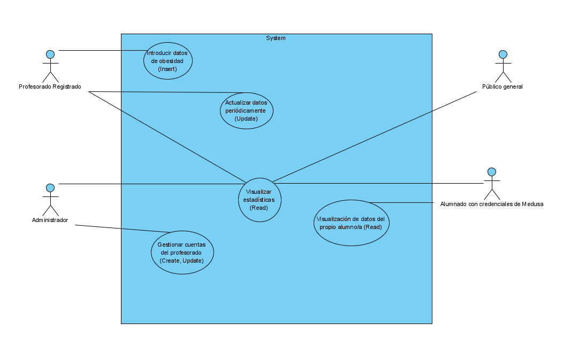
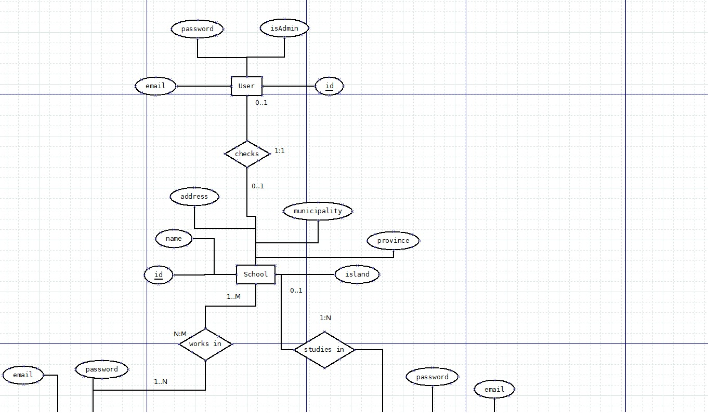
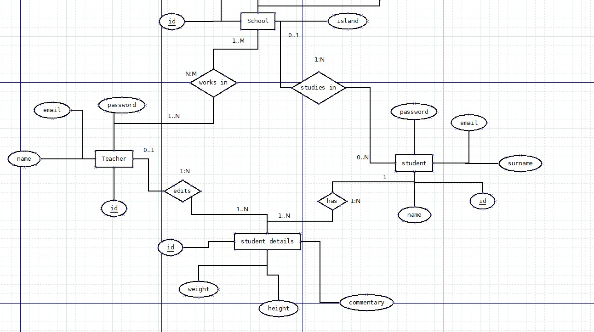
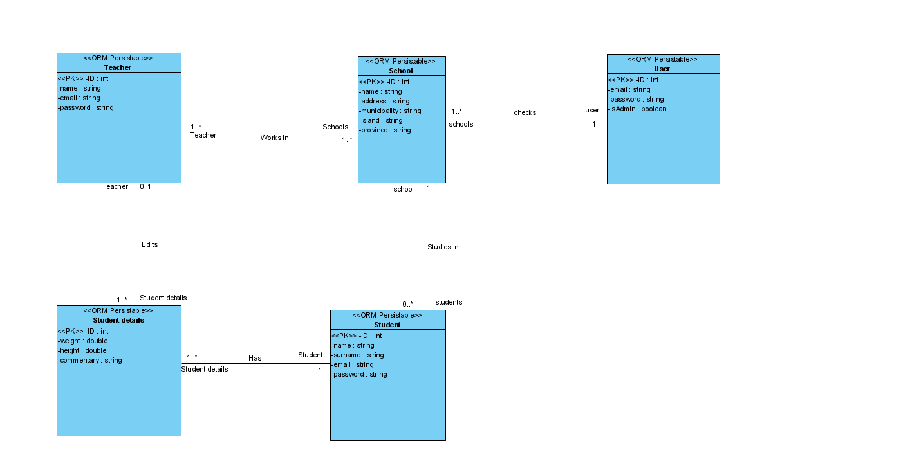

# Proyecto inicial (obesidad en canarias)

  [1.Introduccion](#idIntroduccion)  
  [2.Requisitos](#idRequisitos)  
  [3.Casos de uso](#idCasosDeUso)  
  [4.Diagrama e/r](#idDiagramaer)  
  [5.Diagrama de clases](#idDiagramaClases)  
  [6.Interfaces](#idInterfaces)  

# Introduccion 

Mi app debe tener un diseño simple, por lo que todo es bastante grande en relación a la pantalla y hay muchas ventanas separadas, esto se debe a que el margen de edad del usuario promedio varía desde los 25 hasta los 70 años, por lo que asumo que no todos los usuarios tendrán una vista perfecta.

Las herramientas usadas para mi app son angular para el frontend, y un backend con sequelize, nodeJs, mySql y conexiones con RESTful

# Requisitos 

La app solo requiere de windows 10, un backend funcionando con cualquier ide (preferiblemente visual studio), con los plugins adecuados instalados y la propia aplicación

# Casos de uso 

# Diagrama entidad relación 

# Diagrama de clases 

# Interfaces 

La app comienza con un mapa para elegir el municipio, en el cual clicamos o elegimos en un combobox el municipio sobre el que queramos la información, tras esto tenemos un login sencillo y luego dependiendo de si somos un alumno/padre, administrador o profesorado nos redirige a las ventanas adecuadas

